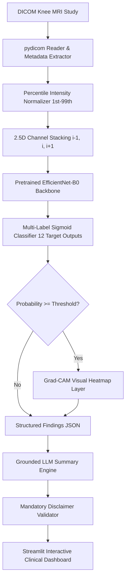

# KNEE-AI Architecture Specification

## 1. System Pipeline Overview

## 2. Hard Architectural Rules Enforced
1. **Multi-Label Independence**: 12 independent sigmoid outputs trained with `BCEWithLogitsLoss`. Studies can exhibit multiple co-occurring abnormalities.
2. **Strict Study-Level Validation**: Zero slice or patient identity leakage. Enforced via hard code assertion in `data/loaders/dataset.py`.
3. **2.5D Feature Input**: Stacks consecutive slices $[i-1, i, i+1]$ as a 3-channel input tensor $[3, 224, 224]$, capturing volumetric spatial context with 2D backbone speed.
4. **LLM Data Boundary**: The LLM layer receives ONLY structured JSON (`{finding: probability, evidence: path}`). Raw DICOM pixel arrays are NEVER passed to the LLM.
5. **Mandatory Disclaimer**: Every screen and LLM report renders the exact warning:  
   *"AI-assisted output for research/prototype purposes. Not a medical diagnosis."*
